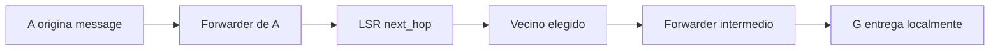

# Laboratorio 3: Routing distribuido sobre TCP

**Reporte técnico final**  
**Proyecto:** `routing-lab`  
**Fecha:** 3 de septiembre de 2026

## Resumen

Este proyecto implementa un sistema de enrutamiento distribuido para ocho nodos identificados como A, B, C, D, E, F, G y H. Los nodos se comunican mediante conexiones TCP persistentes y utilizan paquetes NDJSON con un formato común. El sistema integra transporte, validación de envelopes, health-check, detección de vecinos, deduplicación, flooding, Dijkstra y Link-State Routing (LSR).

La contribución principal de esta entrega es la integración de LSR. Cada nodo mantiene una base de datos de estados de enlaces (LSDB), origina LSPs con números de secuencia monotónicos, descarta información antigua, inunda nuevos anuncios y calcula rutas mediante Dijkstra. También se desarrolló un harness que levanta los ocho nodos, espera la convergencia y verifica un mensaje de prueba desde A hasta G.

La validación final ejecutó los 40 tests disponibles y una prueba de integración real con ocho procesos. El mensaje A -> G fue entregado correctamente y se observó la ruta `A -> H -> G`.

## 1. Introducción

En una red distribuida, un nodo necesita conocer cómo alcanzar destinos que no son vecinos directos. El objetivo del laboratorio es construir mecanismos de forwarding sobre una red local simulada, manteniendo interfaces compatibles entre las distintas partes del proyecto.

El sistema soporta tres modos:

| Modo | Característica |
|---|---|
| `flooding` | Distribuye mensajes a todos los vecinos activos. |
| `dijkstra` | Calcula rutas sobre una topología estática cargada desde archivo. |
| `lsr` | Distribuye estados de enlace y calcula rutas de forma distribuida. |

El alcance de este reporte es documentar la arquitectura integrada, explicar la implementación de LSR, registrar las pruebas realizadas y señalar las limitaciones conocidas.

## 2. Objetivos

### 2.1 Objetivo general

Implementar un sistema de routing distribuido capaz de intercambiar información de estado de enlaces y entregar mensajes de usuario a través de rutas calculadas dinámicamente.

### 2.2 Objetivos específicos

- Definir una interfaz común `Router` para los distintos algoritmos.
- Implementar una LSDB por nodo y el formato LSP requerido.
- Garantizar el descarte de LSPs duplicados o antiguos.
- Reconstruir un grafo no dirigido a partir de la LSDB.
- Calcular próximos saltos con `dijkstra.compute()`.
- Reaccionar a caídas y recuperaciones de vecinos.
- Ejecutar reproduciblemente los ocho nodos en procesos locales.
- Verificar la entrega de un mensaje A -> G y registrar su ruta.

## 3. Requisitos e interfaces

Todos los paquetes utilizan un envelope común con los campos `id`, `proto`, `type`, `from`, `to`, `ttl`, `headers` y `payload`. El campo `proto` identifica el modo activo y puede ser `dijkstra`, `flooding` o `lsr`.

La interfaz común de routing se define mediante un `Protocol`:

```python
class Router(Protocol):
    def next_hop(self, dest: str) -> str | None: ...
    async def on_info(self, pkt: dict, from_id: str) -> None: ...
    def build_local_info(self) -> dict | None: ...
    def recompute(self) -> None: ...
```

Esta separación permite que `Forwarder` entregue mensajes sin conocer los detalles internos de flooding, Dijkstra o LSR.

## 4. Arquitectura del sistema

### 4.1 Transporte

`Transport` abre un servidor TCP por nodo y mantiene conexiones persistentes con los vecinos configurados. Cada paquete se serializa como una línea JSON terminada en salto de línea. Al recibir una línea, el transporte la analiza y entrega el paquete al callback registrado por `node.py`.

El transporte conserva el identificador lógico del nodo en `transport.node_id`. Esto permite que `flooding.flood()` actualice el campo `from` al reenviar un paquete.

### 4.2 Envelope

El módulo `envelope` centraliza la creación, serialización, validación y parseo de paquetes. Los paquetes inválidos se descartan sin derribar la conexión. El identificador `id` permanece sin cambios durante el forwarding y el TTL se reduce en cada salto.

Los principales tipos son:

- `hello`: solicitud periódica de health-check.
- `echo`: respuesta a un `hello`.
- `message`: mensaje de usuario unicast.
- `info`: LSP usado por LSR.

### 4.3 Vecinos y health-check

`NeighborTable` es la fuente de verdad del estado de conectividad. Mantiene los costos, el estado activo/inactivo, fallos consecutivos y RTT. Su método `costs()` devuelve únicamente los costos de vecinos activos.

`HealthCheck` envía `hello` periódicamente y procesa `echo`. Cuando se supera el umbral de fallos, marca un vecino como caído y notifica a los callbacks registrados en `NeighborTable`. Una respuesta posterior recupera el vecino y genera otra notificación.

### 4.4 Deduplicación

`DedupCache` evita procesar repetidamente la misma copia física de un paquete. En el caso de `info`, esta deduplicación por `id` se complementa con la regla semántica de LSR: cada originador tiene una secuencia conocida y solo se aceptan secuencias estrictamente mayores.

### 4.5 Forwarding

`Forwarder` clasifica los paquetes por `type` y delega el trabajo. Los `message` unicast consultan `router.next_hop(dest)`, verifican que el próximo vecino siga activo, reducen TTL y actualizan `headers[].hops`.

Los mensajes entregados localmente se registran en `Forwarder.delivered` y en el log con origen inmediato, lista de saltos y payload. Esta traza es la que utiliza el harness para demostrar la ruta efectiva.

### 4.6 Flooding

`flooding.flood(transport, neighbors, pkt, exclude_id)` realiza una única reducción de TTL, actualiza `from` al nodo que reenvía y envía el paquete a vecinos activos excepto `exclude_id`. LSR pasa el paquete recibido sin preprocesar el TTL, evitando una reducción doble.

### 4.7 Dijkstra

`dijkstra.compute(graph, source)` es una función pura que recibe un grafo ponderado y devuelve, para cada destino alcanzable, su primer salto y costo acumulado. LSR la invoca solo durante `recompute()` y almacena el resultado; `next_hop()` únicamente consulta esa tabla.

## 5. Fuente de topología y configuración

La topología se define en `config/topology.json` como un mapa de adyacencias y costos. Para modo LSR, este archivo controla la adyacencia y los costos activos. Los archivos `A.json` a `H.json` proporcionan los endpoints TCP conocidos; si aparece un enlace nuevo en la topología, se derivan los puertos estándar A-H.

La topología de prueba es:

```json
{
  "A": {"B": 7, "H": 5, "D": 9},
  "B": {"A": 7, "C": 3, "G": 8},
  "C": {"B": 3, "D": 2},
  "D": {"C": 2, "E": 4, "A": 9},
  "E": {"D": 4, "F": 1},
  "F": {"E": 1, "G": 6},
  "G": {"F": 6, "H": 2, "B": 8},
  "H": {"G": 2, "A": 5}
}
```

Una topología alternativa puede probarse cambiando únicamente `config/topology.json`, sin modificar LSR, Dijkstra ni el harness.

## 6. Implementación de LSR

### 6.1 Estado interno

Cada `LSRRouter` conserva:

- `node_id`: identidad local.
- `_seq`: secuencia local del siguiente LSP.
- `lsdb`: estados aceptados por originador.
- `_table`: tabla calculada de próximos saltos.
- `neighbors`: referencia a `NeighborTable`.
- `transport`: referencia usada para flooding.

La LSDB tiene esta forma conceptual:

```python
{
    "A": {
        "seq": 3,
        "neighbors": {"B": 7.0, "H": 5.0}
    }
}
```

### 6.2 Originación de LSPs

`build_local_info()` incrementa `_seq`, toma una copia de `neighbors.costs()` y devuelve un payload con `origin`, `seq` y `neighbors`. También actualiza inmediatamente el registro local de la LSDB y recalcula la tabla.

El anuncio completo se construye con `envelope.make()` como paquete `info`, con `proto="lsr"`, `to="*"` y el TTL inicial configurado. El método `run()` publica el LSP al arrancar y vuelve a publicarlo después de un segundo. Esta segunda publicación cubre la carrera entre el inicio de los nodos y el establecimiento de sus conexiones TCP.

### 6.3 Recepción y control de secuencia

Al recibir un paquete `info`, LSR valida que el payload tenga tipos válidos, extrae `origin`, `seq` y `neighbors`, y compara la secuencia con la entrada de la LSDB.

La regla implementada es:

```text
seq <= último_seq_conocido  -> descartar
seq >  último_seq_conocido  -> aceptar
```

Un anuncio aceptado se almacena antes de cualquier reflood. Luego se ejecuta `recompute()` y se llama a `flooding.flood()` excluyendo al vecino por el que llegó el paquete. De esta forma, el mismo LSP puede recorrer la red, pero cada nodo procesa una secuencia solo una vez.

### 6.4 Reconstrucción del grafo

La LSDB contiene anuncios dirigidos, pero Dijkstra recibe un grafo no dirigido. Para cada arista anunciada `origin -> neighbor` con costo `w`, LSR agrega:

```text
graph[origin][neighbor] = w
graph[neighbor][origin] = w
```

También crea nodos aislados para originadores conocidos. Si dos anuncios válidos presentan costos diferentes para la misma arista, se conserva el menor costo anunciado. Esta política es determinista y no inventa valores.

### 6.5 Recomputación y próximos saltos

`recompute()` reconstruye el grafo actual y llama:

```python
self._table = dijkstra.compute(graph, self.node_id)
```

La tabla resultante guarda el primer salto real desde el nodo local. Por consecuencia, una consulta como `next_hop("G")` devuelve directamente el vecino al que debe enviarse el paquete, o `None` si el destino es local, inalcanzable o no tiene entrada.

### 6.6 Cambios de vecinos

El router se suscribe a `neighbors.on_change()`. Cuando un vecino cae o se recupera, se crea una tarea asíncrona que origina un nuevo LSP. La nueva secuencia permite que el resto de la red reemplace el estado anterior y vuelva a calcular las rutas.

## 7. Flujo de un mensaje A -> G

El recorrido lógico de una prueba es:



Antes de enviar el mensaje, los nodos han distribuido sus LSPs. El mensaje no se inunda: cada `Forwarder` consulta la tabla de próximos saltos y añade su identidad a `headers[].hops`.

## 8. Harness de integración

`src/harness/run_all.py` ejecuta los siguientes pasos:

1. Inicia A, B, C, D, E, F, G y H como procesos independientes.
2. Captura y muestra la salida de cada proceso con su identificador.
3. Comprueba que ningún proceso haya terminado durante la convergencia.
4. Espera el tiempo configurable de convergencia.
5. Inyecta un paquete `message` desde A hacia G por TCP.
6. Comprueba que ningún proceso muera antes de la entrega.
7. Busca el log de entrega de G y muestra `headers[].hops`.
8. Termina todos los procesos, incluso en caso de error.

Ejemplo de ejecución:

```text
Starting nodes A B C D E F G H...
Waiting 3s for LSR convergence...
Sending test message A -> G
G | ... mensaje entregado from=H hops=['A', 'H'] payload='LSR harness test'
Message delivered successfully
```

El harness no fija una ruta concreta. La ruta depende de la topología y de los costos cargados en tiempo de ejecución.

## 9. Estrategia de pruebas

### 9.1 Pruebas unitarias existentes

La suite disponible cubre 40 casos:

| Módulo | Aspectos verificados |
|---|---|
| `test_envelope.py` | Creación, defaults, parseo, serialización y validación. |
| `test_neighbors.py` | Actividad, costos, fallos, recuperación y callbacks. |
| `test_healthcheck.py` | Hello/echo, secuencias, RTT y umbrales de caída. |
| `test_dedup.py` | Expiración y detección de paquetes repetidos. |
| `test_dijkstra.py` | Caminos mínimos, costos, primer salto y destinos inalcanzables. |

### 9.2 Pruebas específicas de integración

Se ejecutó un smoke test de LSR que verificó:

- generación del primer LSP local con `seq == 1`;
- actualización de LSDB al recibir un LSP nuevo;
- cálculo de una ruta indirecta mediante Dijkstra;
- descarte de un LSP repetido con el mismo `origin` y `seq`.

También se verificó que `config.load("config/A.json")` obtuviera para A los costos `{B: 7, H: 5, D: 9}` desde `topology.json`.

### 9.3 Prueba end-to-end

Comando utilizado:

```powershell
C:/Python313/python.exe -m src.harness.run_all --convergence 3 --delivery-timeout 6
```

Resultado observado el 3 de septiembre de 2026:

```text
Starting nodes A B C D E F G H...
Waiting 3s for LSR convergence...
Sending test message A -> G
G | ... mensaje entregado from=H hops=['A', 'H'] payload='LSR harness test'
Message delivered successfully
```

Resultado de la suite:

```text
40 passed in 0.43s
```

## 10. Resultados

Los resultados confirman que:

- los ocho procesos pueden iniciar en una misma máquina;
- los endpoints TCP se conectan según la topología configurada;
- el anuncio inicial de LSR logra convergencia pese al arranque concurrente;
- los LSPs se procesan por secuencia y se vuelven a inundar cuando son nuevos;
- Dijkstra genera próximos saltos utilizables por mensajes normales;
- G recibe correctamente el mensaje de prueba;
- la ruta efectiva queda registrada en la cabecera de saltos;
- el harness limpia los procesos al finalizar.

## 11. Discusión

### 11.1 Decisiones técnicas

Se mantuvo una interfaz `Router` pequeña para evitar acoplar `Forwarder` a un algoritmo concreto. El control de duplicados se dividió en dos niveles: la cache por `id` resuelve copias físicas y LSR resuelve versiones por originador. Esta separación sigue la semántica del protocolo.

La reconstrucción simétrica del grafo permite que un anuncio de un solo extremo sea útil mientras la red converge. La política de mínimo costo ante inconsistencias evita resultados dependientes del orden de llegada, aunque la configuración de producción debería mantener costos simétricos.

### 11.2 Convergencia

La red se inicia de forma concurrente. Algunos LSP iniciales pueden generarse antes de que los sockets estén listos. Por ello, LSR realiza un segundo anuncio inicial. En una implementación de mayor escala sería preferible coordinar una fase explícita de descubrimiento o mantener anuncios periódicos con expiración.

### 11.3 Limitaciones

- La topología y los endpoints se ejecutan localmente; no se modelan pérdidas parciales ni latencias de Internet.
- La LSDB no implementa expiración temporal de LSPs.
- El harness verifica entrega y supervivencia de procesos, pero no compara la ruta contra un camino esperado fijo, porque la ruta debe depender de la topología.
- La política de conflicto usa el menor costo anunciado; no existe todavía autenticación o validación de autoridad del originador.
- El PDF se genera a partir del reporte Markdown mediante `reportlab`.

## 12. Conclusiones

Se construyó una implementación integrada de routing distribuido sobre TCP con una interfaz común para varios algoritmos. La implementación LSR mantiene una LSDB funcional, origina y distribuye LSPs versionados, descarta información antigua, reconstruye un grafo no dirigido y obtiene próximos saltos con Dijkstra.

La integración con `NeighborTable` permite reflejar cambios de conectividad en nuevos anuncios. El harness demuestra el funcionamiento de extremo a extremo al iniciar los ocho nodos y entregar un mensaje A -> G por la ruta calculada. La suite unitaria y la prueba de integración proporcionan evidencia reproducible de los resultados.

Como trabajo futuro se podrían agregar expiración de LSPs, pruebas unitarias específicas para `LSRRouter`, instrumentación formal del tiempo de convergencia y escenarios automatizados de caída y recuperación durante una transmisión.

## 13. Instrucciones de reproducción

Instalación en PowerShell:

```powershell
python -m venv .venv
.venv\Scripts\pip install -r requirements.txt
```

Ejecutar un nodo:

```powershell
.venv\Scripts\python -m src.node --config config/A.json
```

Ejecutar los ocho nodos:

```powershell
.venv\Scripts\python -m src.harness.run_all
```

Ejecutar tests:

```powershell
.venv\Scripts\python -m pytest tests/
```

Con `make`, los equivalentes son `make venv`, `make run NODE=A`, `make run-all` y `make test`.

## 14. Archivos principales

- [README.md](../README.md): instalación, ejecución y contratos generales.
- [router.py](../src/router.py): interfaz común `Router`.
- [lsr.py](../src/lsr.py): LSDB, LSPs, flooding y recomputación.
- [config.py](../src/config.py): carga de configuración y topología.
- [harness/run_all.py](../src/harness/run_all.py): prueba de ocho nodos.
- [topology.json](../config/topology.json): topología de prueba.
- [reference-spec-v1.md](reference-spec-v1.md): especificación de interoperabilidad.

## 15. Evidencias de ejecución

### 15.1 Suite de pruebas unitarias

Comando ejecutado:

```powershell
.venv\Scripts\python.exe -m pytest tests/ -v
```

Salida resumida:

```text
platform win32 -- Python 3.13.5
collected 40 items

tests/test_dedup.py              4 passed
tests/test_dijkstra.py          11 passed
tests/test_envelope.py          13 passed
tests/test_healthcheck.py        6 passed
tests/test_neighbors.py          6 passed

============================= 40 passed in 0.30s =============================
```

La salida detallada mostró cada caso individual con estado `PASSED`, incluyendo
validación de envelopes, cálculo de caminos, detección de fallos, recuperación
de vecinos y deduplicación.

### 15.2 Ejecución de los ocho nodos

Comando ejecutado:

```powershell
.venv\Scripts\python.exe -m src.harness.run_all --convergence 4 --delivery-timeout 6
```

Extracto real de la salida:

```text
Starting nodes A B C D E F G H...
Waiting 4s for LSR convergence...
A: listening on 0.0.0.0:5001
B: listening on 0.0.0.0:5002
C: listening on 0.0.0.0:5003
D: listening on 0.0.0.0:5004
E: listening on 0.0.0.0:5005
F: listening on 0.0.0.0:5006
G: listening on 0.0.0.0:5007
H: listening on 0.0.0.0:5008
Sending test message A -> G
G | mensaje entregado from=H hops=['A', 'H'] payload='LSR harness test'
Message delivered successfully
```

Esta evidencia demuestra que los ocho procesos iniciaron, escucharon en sus
puertos, establecieron conexiones, esperaron la convergencia y entregaron el
mensaje de prueba en G. El harness también verifica que ningún proceso termine
prematuramente y finaliza todos los procesos al terminar la prueba.

### 15.3 Comprobación de configuración

```text
configuration validation passed for A-H and symmetric topology
topology source check passed: {'B': 7, 'H': 5, 'D': 9}
```

La comprobación confirma que cada configuración usa el nodo y puerto correctos,
que todos trabajan en modo `lsr`, que referencian `topology.json` y que las
aristas de la topología son simétricas.

### 15.4 Evidencia visual

Los tests y el harness actuales no generan capturas de pantalla ni gráficos
automáticamente. La evidencia visual del protocolo está representada por el
diagrama Mermaid del flujo A -> G incluido en la sección 7. El PDF contiene
esta documentación y los extractos de consola anteriores.
